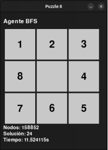
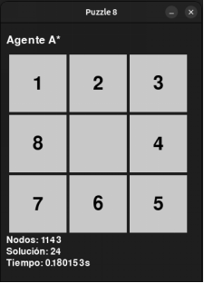

# 🧠 Puzzle8: Resolución Autónoma del Puzzle 8 usando Búsqueda Informada y No Informada

Este proyecto implementa dos agentes inteligentes capaces de resolver el clásico **Puzzle 8** de forma autónoma:

- 🧮 **Agente 1 (No Informado):** Utiliza el algoritmo de **Búsqueda en Anchura (BFS)**.
- 🧠 **Agente 2 (Informado):** Aplica el algoritmo **A\*** con la **heurística de distancia Manhattan**.

Ambos agentes se ejecutan **en paralelo**, lo que permite visualizar en tiempo real su desempeño al resolver el mismo puzzle.

---

## 🧩 Características del Proyecto

- Generación aleatoria de tableros iniciales **resolubles**
- Visualización de los movimientos de ambos agentes usando **Pygame**
- Comparación de rendimiento:
  - Tiempo de ejecución
  - Nodos expandidos
  - Longitud de la solución
- Detección de puzzles **irresolubles**
- Generación automática de un nuevo puzzle una vez que ambos agentes finalizan

---

## 🚀 Captura de Funcionamiento

📸 





---

## 🛠️ Tecnologías y Librerías

- Lenguaje: **Python 3.12.3**
- Visualización: **Pygame**
- Estructuras de datos: `queue`, `heapq`, `set`, `copy`
- Medición de rendimiento: `time`, `datetime`

---

## 📦 Instalación y Ejecución

1. **Clona el repositorio**
   ```
   git clone https://github.com/mariadev22/resolucion-automatizada-puzzle8?tab=readme-ov-file
   ```
